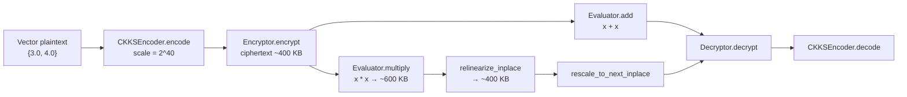

# CKKS-SEAL PPML

**Thử nghiệm Mã hóa Đồng hình Đa thức CKKS trên Microsoft SEAL 4.1.2 cho Học máy Bảo mật**

*Privacy-Preserving Machine Learning (PPML) · Fully Homomorphic Encryption (FHE) · Scheme CKKS · Microsoft SEAL 4.1.2*

Kho mã này là proof-of-concept C++ nhằm kiểm chứng luồng **Encode → Encrypt → Evaluate → Relinearize → Rescale → Decrypt** trên lược đồ CKKS. Mục tiêu gần là xác nhận các phép cộng/nhân đồng hình (`x + x`, `x * x`) trên vector số thực. Mục tiêu xa — theo bài báo *Privacy-Preserving Decision Trees Training and Prediction* (Akavia et al., 2022) — là tích hợp phân nhánh cây quyết định đầy đủ trên ciphertext.

---

## 🎯 Tổng quan & Mục tiêu Nghiên cứu

Học máy hiện đại phụ thuộc vào dữ liệu nhạy cảm (hồ sơ y tế, giao dịch tài chính, định danh). Các khung pháp lý như GDPR và Luật An ninh mạng yêu cầu bảo vệ dữ liệu gốc, trong khi nhiều bài toán thực tế (phòng chống rửa tiền, chẩn đoán, làm sạch dữ liệu liên tổ chức) lại cần **tính toán cộng tác** mà không được lộ plaintext.

**Mã hóa đồng hình (Homomorphic Encryption, HE)** cho phép thực hiện phép toán trực tiếp trên bản mã:

- **Đồng hình cộng (AE):** $Enc(x) + Enc(y) = Enc(x+y)$
- **Đồng hình nhân (ME):** $Enc(x) \cdot Enc(y) = Enc(x \cdot y)$

Khi hệ mã hỗ trợ cả hai phép toán tùy ý, ta có **mã hóa đồng hình hoàn toàn (FHE)**. Server có thể huấn luyện hoặc suy luận trên ciphertext; client giữ secret key và chỉ giải mã kết quả cuối.

Kho này phục vụ ba mục tiêu:

1. **Kiểm chứng toolchain** Microsoft SEAL 4.1.2 trên Windows/MSVC, C++17, CMake.
2. **Khóa cấu hình CKKS** phù hợp học máy số thực: $N = 8192$, $q \approx 200$ bit, $\Delta = 2^{40}$, 4096 SIMD slots.
3. **Mở đường** cho Decision Tree bảo mật: thay hàm bước rời rạc bằng đa thức *soft-step* (chỉ gồm cộng và nhân) theo Akavia et al. (2022).

> **Phạm vi hiện tại.** `tests-build.cpp` chỉ chạy primitive CKKS trên vector `{3.0, 4.0}`. Không có log huấn luyện Iris/Cat–Dog trong repository này. Các kết quả Decision Tree nêu ở mục 3 là phát hiện từ báo cáo thực tập và bài báo tham chiếu, không phải output của binary hiện tại.

---

## 🔬 Cơ sở Lý thuyết & Bài báo Tham khảo

### Vì sao CKKS, không phải RSA / Paillier / BFV?

Tài liệu lý thuyết nội bộ so sánh ba họ hệ mã tiêu biểu:

| Tiêu chí | RSA | Paillier | BFV / CKKS (họ lattice) |
|---|---|---|---|
| Phép đồng hình | Chỉ nhân (ME) | Chỉ cộng (AE) | Cộng **và** nhân (FHE) |
| Bản rõ | Một số nguyên \(M\) | Một số nguyên | Vector được nén vào đa thức (batching / SIMD) |
| Giả định an toàn | Factoring | Composite Residuosity | **Ring-LWE** |
| An toàn lượng tử | Không (Shor) | Không | **Post-quantum** (lattice) |
| Ứng dụng điển hình | Chữ ký, trao đổi khóa | Bỏ phiếu, tính tổng | Tính toán trên dữ liệu mã hóa, PPML |

RSA và Paillier không đủ cho học máy: mô hình cần chuỗi cộng–nhân. BFV xử lý số nguyên chính xác; **CKKS** (Cheon–Kim–Kim–Song) mã hóa số thực/phức xấp xỉ — phù hợp đặc trưng ML, trọng số và ngưỡng liên tục. An toàn dựa trên Ring-LWE trên vành thương $\mathcal{R}_q = \mathbb{Z}_q[X]/(X^N+1)$.

### Ba bài báo định hướng nghiên cứu

1. **Akavia, A., Leibovich, M., Resheff, Y. S., Ron, R., Shahar, M. & Vald, M.** (2022). *Privacy-Preserving Decision Trees Training and Prediction.*  
   Tư tưởng cốt lõi: FHE **không hỗ trợ so sánh / rẽ nhánh** (`>`, `if`). Tại mỗi node, phép $x_i \ge \theta$ được viết lại thành hàm bước $I(z)$, rồi xấp xỉ bằng **đa thức soft-step** tìm bằng bình phương tối thiểu có trọng số trên $[-2, 2]$ (dữ liệu đã scale về $[-1, 1]$). Đa thức chỉ gồm cộng và nhân nên chạy được trên ciphertext. Lũy thừa bậc cao dùng *binary exponentiation* để giảm multiplicative depth và nhiễu.

2. **Nguyen, K., Budzys, M., Frimpong, E., Khan, T. & Michalas, A.** (2024). *A Pervasive, Efficient and Private Future: Realizing Privacy-Preserving Machine Learning Through Hybrid Homomorphic Encryption.*  
   Hybrid HE kết hợp mã đối xứng (nhẹ phía client) với FHE phía server, giảm chi phí truyền ciphertext lớn — phù hợp kiến trúc client–server mà báo cáo thực tập hướng tới (client giữ secret key, server chỉ đánh giá trên bản mã).

3. **Effendi, F. & Chattopadhyay, A.** (2024). *Privacy-Preserving Graph-Based Machine Learning with Fully Homomorphic Encryption for Collaborative Anti-Money Laundering.*  
   Minh họa FHE trên bài toán liên tổ chức (AML): nhiều bên đóng góp đặc trưng mà không lộ giao dịch gốc. Cùng bài toán quyền riêng tư mà Decision Tree bảo mật hướng tới trong tài chính.

### Cầu nối từ lý thuyết cây đến FHE

Cây quyết định (CART) chọn feature theo Gini / Entropy / Information Gain, rồi rẽ nhánh tại ngưỡng $\theta$. Trong FHE:

- So sánh rời rạc bị thay bằng $\varphi(x_i - \theta) \approx I(x_i - \theta)$.
- Trọng số mẫu rơi trái/phải được nhân-cộng đồng hình (`compute_weighted_counts_homo` trong báo cáo).
- SIMD/batching của CKKS (4096 slot) cho phép mã hóa cả một cột đặc trưng vào **một** ciphertext; Galois keys hỗ trợ `rotate` để gom slot hoặc quét nhiều ngưỡng.

Báo cáo thực tập (CMC ATI, 2025) ghi nhận hướng này khả thi trên tập nhỏ (Iris, 4 feature × 2 ngưỡng, accuracy tham chiếu ~90% ở pipeline Decision Tree riêng), nhưng chi phí FHE tăng nhanh khi số ngưỡng tăng (Cat–Dog, 32 ngưỡng: thời gian ước tính theo tuần). **Repository này chưa tái lập các số liệu đó**; chúng chỉ xác nhận động lực cho Future Work ở mục 7.

---

## ⚙️ Cấu hình Kỹ thuật & Tham số Mã hóa

Mọi số liệu dưới đây lấy trực tiếp từ `tests-build.cpp` và `CMakeLists.txt`, cộng với hệ quả lý thuyết của cấu hình CKKS đó. Không có profiler log được bịa thêm.

### Thư viện & toolchain

| Thành phần | Giá trị trong repo |
|---|---|
| Thư viện FHE | **Microsoft SEAL 4.1.2** (`SEAL_VERSION` trong `SEAL_Build/native/src/seal/util/config.h`) |
| Ngôn ngữ | **C++17** (`CMAKE_CXX_STANDARD 17`) |
| Trình biên dịch | **MSVC v143** (Visual Studio 2022 Build Tools) |
| Hệ sinh CMake | CMake 3.12+; generator `Visual Studio 17 2022` |
| Target CMake | `project(DecisionTreeSEAL)` → executable `tests-build` |
| Liên kết | `target_link_libraries(tests-build SEAL::seal)` |

### Tham số CKKS (khóa cứng trong `tests-build.cpp`)

```cpp
EncryptionParameters parms(scheme_type::ckks);
size_t poly_modulus_degree = 8192;
parms.set_poly_modulus_degree(poly_modulus_degree);
parms.set_coeff_modulus(CoeffModulus::Create(poly_modulus_degree, {60, 40, 40, 60}));
double scale = pow(2.0, 40);
```

| Tham số | Ký hiệu | Giá trị | Ý nghĩa |
|---|---|---|---|
| Scheme | — | **CKKS** | Số thực xấp xỉ, batching SIMD |
| Poly modulus degree | \(N\) | **8192** ($2^{13}$) | Bậc vành \(X^N+1\); mức an toàn ~128-bit với chuỗi modulus dưới đây |
| Coeff modulus | \(q\) | **200 bit** = \(\{60, 40, 40, 60\}\) | Hai prime 60-bit đầu/cuối giữ độ chính xác encode–decode; hai prime 40-bit giữa cho ~2–3 phép nhân (multiplicative depth) |
| Scale | $\Delta$ | **$2^{40}$** | Khớp modulus 40-bit ở giữa; rescale sau mỗi nhân để \(\Delta\) không nổ |
| SIMD slots | \(N/2\) | **4096** | Số giá trị thực đóng gói trong một ciphertext |
| Vector minh họa | — | `{3.0, 4.0}` | Hai slot đầu; các slot còn lại là 0 sau encode |

Khóa được sinh trong demo: **public key**, **secret key**, **relinearization keys**, **Galois keys**. Secret key chỉ dùng lúc `Decryptor::decrypt`. Relinearize là bắt buộc sau `multiply`. Galois keys được sinh sẵn (chuẩn bị rotate SIMD) nhưng primitive hiện tại chưa gọi `rotate_vector`.

### Dung lượng ciphertext (hệ quả của \(N\) và \(q\))

Một ciphertext CKKS lưu $k$ đa thức hệ số modulo $q$. Với $N = 8192$ và $\log_2 q \approx 200$:

$$\text{size} \approx k \cdot N \cdot \frac{\log_2 q}{8} \quad\Rightarrow\quad \begin{cases} k=2 \text{ (sau mã hóa / sau relinearize):} & 2 \times 8192 \times 25 \approx \mathbf{400\ KB} \\ k=3 \text{ (sau nhân, trước relinearize):} & 3 \times 8192 \times 25 \approx \mathbf{600\ KB} \end{cases}$$

Đây là kích thước bản mã **chưa nén** tương ứng cấu hình trên, không phải số đo từ một file log huấn luyện.

| Trạng thái | Số đa thức \(k\) | Dung lượng xấp xỉ |
|---|---|---|
| Sau `encrypt` / sau `add` / sau `relinearize` | 2 | **~400 KB** |
| Sau `multiply`, **trước** `relinearize` | 3 | **~600 KB** |

Relinearize đưa $k: 3 \to 2$, trả ciphertext về ~400 KB và giảm chi phí các phép sau. Rescale (`rescale_to_next`) cắt một prime 40-bit khỏi chuỗi \(q\), hạ nhiễu và giữ scale ổn định — bắt buộc sau nhân trong CKKS.

---

## 🛠️ Quy trình Vận hành Pipeline

Luồng trong `tests-build.cpp` bám đúng vòng đời CKKS của SEAL:



1. **Encode.** `CKKSEncoder` nhúng vector thực vào đa thức trên 4096 slot, nhân scale $2^{40}$.
2. **Encrypt.** Public key tạo ciphertext bậc 2 (~400 KB).
3. **Evaluate — cộng.** `evaluator.add(encrypted, encrypted, encrypted_add)` ≡ \(x+x\) từng slot. Cộng **không** tăng bậc, không cần relinearize/rescale.
4. **Evaluate — nhân.** `evaluator.multiply` nhân hai ciphertext cùng slot → bậc 3 (~600 KB).
5. **Relinearize.** `relinearize_inplace(..., relin_keys)` hạ bậc 3 → 2.
6. **Rescale.** `rescale_to_next_inplace` bỏ một modulus 40-bit, đưa scale về gần \(2^{40}\) cho tầng tính toán kế tiếp.
7. **Decrypt + Decode.** Secret key giải mã; encoder đọc lại số thực. Kỳ vọng lý thuyết (CKKS là lược đồ *xấp xỉ*):
   - $x+x$: $\{6.0,\ 8.0\}$
   - $x \cdot x$: $\{9.0,\ 16.0\}$
   - Sai số làm tròn ở bậc $2^{-\Theta(40)}$ là bình thường; **không** interpret đây như log huấn luyện mô hình.

Client–server (định hướng kiến trúc trong báo cáo, chưa tách process trong code): client encode/encrypt và giữ secret key; server chỉ `Evaluator`; kết quả ciphertext trả về client để decrypt.

---

## 🚀 Hướng dẫn Cài đặt & Chạy Code

Môi trường đã kiểm chứng: **Windows 10/11**, Visual Studio 2022 Build Tools, CMake, x64.

### 1. Cài Build Tools

Tải [Visual Studio Build Tools](https://visualstudio.microsoft.com/visual-cpp-build-tools/) và chọn workload:

- Desktop development with C++
- **MSVC v143** build tools
- Windows 10/11 SDK

Cần CMake (đi kèm Build Tools hoặc bản độc lập ≥ 3.12).

### 2. Lấy mã nguồn Microsoft SEAL 4.1.2

Cấu trúc làm việc khớp cache hiện tại (`SEAL_SOURCE_DIR = .../SEAL`):

```
Build-Microsoft-SEAL/
├── SEAL/                 ← clone microsoft/SEAL (tag v4.1.2)
├── SEAL_Build/           ← out-of-source build của thư viện
├── Project_Build/        ← out-of-source build của demo
├── CMakeLists.txt
└── tests-build.cpp
```

```powershell
git clone --branch v4.1.2 https://github.com/microsoft/SEAL.git SEAL
```

### 3. Biên dịch thư viện SEAL

```powershell
mkdir SEAL_Build
cd SEAL_Build
cmake ..\SEAL -G "Visual Studio 17 2022" -A x64
cmake --build . --config Release
cd ..
```

Nếu đã cài Intel TBB qua vcpkg (tùy chọn, multi-thread đa thức):

```powershell
cmake ..\SEAL -G "Visual Studio 17 2022" -A x64 `
  -DTBB_DIR=C:\path\to\vcpkg\installed\x64-windows\share\tbb
```

File cấu hình CMake của SEAL nằm tại `SEAL_Build/cmake` (dùng cho `-DSEAL_DIR` ở bước sau).

### 4. Biên dịch demo `tests-build`

Từ thư mục gốc repo:

```powershell
mkdir Project_Build
cd Project_Build
cmake .. -G "Visual Studio 17 2022" -A x64 `
  -DCMAKE_BUILD_TYPE=Release `
  -DSEAL_DIR="<đường-dẫn-tuyệt-đối>/SEAL_Build/cmake"
cmake --build . --config Release
```

Ví dụ trên máy đã build sẵn:

```powershell
cmake .. -G "Visual Studio 17 2022" -A x64 `
  -DSEAL_DIR="C:/Build-Microsoft-SEAL/SEAL_Build/cmake"
```

### 5. Chạy

```powershell
.\Release\tests-build.exe
```

Output do chương trình in ra (không phải log profiler):

```
SEAL context đã khởi tạo thành công!
Đã mã hóa xong vector {3.0, 4.0}

Kết quả cộng (x + x): <≈ 6>, <≈ 8>
Kết quả nhân (x * x): <≈ 9>, <≈ 16>
```

Hai số sau dấu phẩy là slot 0 và slot 1 của vector đã decode. Giá trị CKKS có thể lệch rất nhỏ so với số nguyên đúng.

### Phụ thuộc tùy chọn (không bắt buộc cho demo hiện tại)

README cũ ghi nhận **vcpkg + nlohmann-json** cho chuyển JSON ↔ C++ khi mở rộng pipeline client–server. `tests-build.cpp` hiện **không** link nlohmann-json.

---

## 🔮 Hướng Phát triển Tiếp theo (Future Work)

Bước tiếp theo — đúng phạm vi bài báo Akavia et al. (2022) và chương thực nghiệm của báo cáo thực tập — là **tích hợp phân nhánh Decision Tree đầy đủ trên ciphertext**, không dừng ở primitive `x+x` / `x*x`.

Các hạng mục cụ thể:

1. **Soft-step trên CKKS.** Thay $I(x_i-\theta)$ bằng đa thức bậc lẻ (ví dụ bậc 5) học bằng least squares có trọng số trên $[-2,2]$; tính $z^k$ bằng binary exponentiation để tiết kiệm depth trên chuỗi $\{60,40,40,60\}$.
2. **Secure split.** `compute_weighted_counts_homo`: nhân trọng số mẫu với $\varphi$ và $1-\varphi$ để đếm trái/phải mà không giải mã nhãn.
3. **Cập nhật trọng số lá và predict.** Nhân-cộng dọc cây; output là vector ciphertext theo lớp, client mới decrypt.
4. **Khai thác 4096 slot.** Một cột feature / một vector ngưỡng trong cùng ciphertext; `rotate_vector` + Galois keys để giảm số ciphertext (báo cáo đề xuất gộp nhiều ngưỡng, tránh hard-code lưới 0.05 trên $[-1,-0.2]\cup[0.2,1]$).
5. **Tách client–server.** Client encode–encrypt–decrypt; server chỉ `Evaluator`. Có thể bổ sung toàn vẹn kênh (hash + chữ ký) như định hướng nhật ký thực tập.
6. **Quản lý depth.** Cấu hình 200-bit hiện tại đủ cho demo nhân một lần; cây sâu / soft-step bậc cao sẽ cần chuỗi modulus dài hơn, hoặc bootstrapping (OpenFHE), sau khi primitive SEAL đã ổn.

Hướng mở ngoài cây: Hybrid HE (Nguyen et al., 2024) để giảm bandwidth ~400–600 KB/ciphertext; đồ thị FHE cho AML cộng tác (Effendi & Chattopadhyay, 2024); **không** mở rộng phạm vi cho đến khi phân nhánh Decision Tree trên CKKS chạy đúng trên cùng tham số $N=8192$, $q=\{60,40,40,60\}$, $\Delta=2^{40}$.

---

## Tài liệu tham khảo

1. Adi Akavia, Max Leibovich, Yehezkel S. Resheff, Roey Ron, Moni Shahar, and Margarita Vald. *Privacy-Preserving Decision Trees Training and Prediction.* 2022.
2. Khoa Nguyen, Mindaugas Budzys, Eugene Frimpong, Tanveer Khan, and Antonis Michalas. *A Pervasive, Efficient and Private Future: Realizing Privacy-Preserving Machine Learning Through Hybrid Homomorphic Encryption.* 2024.
3. Fabrianne Effendi and Anupam Chattopadhyay. *Privacy-Preserving Graph-Based Machine Learning with Fully Homomorphic Encryption for Collaborative Anti-Money Laundering.* 2024.
4. Jung Hee Cheon, Andrey Kim, Miran Kim, and Yongsoo Song. *Homomorphic Encryption for Arithmetic of Approximate Numbers (CKKS).* ASIACRYPT 2017.

---

**Giấy phép thành phần.** Microsoft SEAL được phân phối theo giấy phép MIT của Microsoft Corporation. Mã demo trong `tests-build.cpp` là phần thực nghiệm PPML của dự án, không sửa đổi mã nguồn thư viện SEAL.
